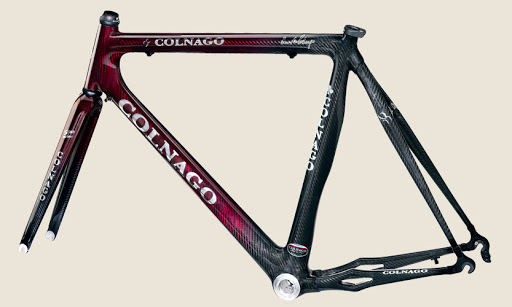

<!-- This file contains many elements adapted from the online tutoral -->
<!-- on Bootstrap 4 as found here: https://www.w3schools.com/bootstrap4/default.asp -->

<!-- Images source: -->
<!-- jule.jpg taken from https://www.freepik.com/premium-vector/cartoon-successful-hairdresser_3951066.htm -->
<!-- Erwind.jpb https://www.kijiji.ca/v-construction-trades-jobs/winnipeg/bicycle-mechanic/1499188319 -->

<!DOCTYPE html>
<html lang="en">

<!-- The head should contain an appropriate title for your site -->
<head>
    <title>Module 4 - Labo</title>
    <meta charset="UTF-8">
    <meta name="viewport" content="width=device-width, initial-scale=1">

    <!-- Style sheet (CSS) and JavaScript scripts necessary to use Bootstrap -->
    <link rel="stylesheet" href="https://maxcdn.bootstrapcdn.com/bootstrap/4.5.0/css/bootstrap.min.css">
    
    
        

    <!-- Your own additional style sheet -->
    <link href="styles/style.css" rel="stylesheet" type="text/css">
    <!-- Style sheet (CSS) and JavaScript scripts necessary to use JQuery as well as JQueryUI library -->
    <!-- which is built on top of JQuery and offers additional possibilities -->
    <!-- For example, JQuery UI has a datepicker which is popular and that we can use -->
    <link href="http://ajax.googleapis.com/ajax/libs/jqueryui/1.9.2/themes/sunny/jquery-ui.css" rel="stylesheet" type="text/css">
    
    
  </head>

<body>

    <!-- Medium size container, padding 3, margins 3, background dark, text is white -->
    <!-- Should show the name of your company with an image or logo -->
    <!-- Bootstrap has its own font for H1, H2, p, etc.  -->
    <!-- Look in BS4 Typography https://www.w3schools.com/bootstrap4/bootstrap_typography.asp -->
    <!-- Use your own CSS file to change those fonts if they do not correspond to your company's look -->
    

        <h1>Welcome to GearFixem</h1>
        
We Fixe Your Wheels!

        
Find us at: 1174 tawney rd

    

    <!-- Bootstrap contains a grid system you can explore https://www.w3schools.com/bootstrap4/bootstrap_grid_system.asp -->
    <!-- It can be useful for placement of information -->
    <nav class="navbar  sticky-top navbar-expand-lg navbar-light " id="nav">
    <a class="navbar-brand" href="#">
     GearFixem </a>

    <button class="navbar-toggler" type="button" data-toggle="collapse" data-target="#navbarSupportedContent" aria-controls="navbarSupportedContent" aria-expanded="false" aria-label="Toggle navigation">
    
    </button>

  

    <ul class="navbar-nav mr-auto" id="navco">
      <li class="nav-item active">
        <a class="nav-link" href="#">Home (current)</a>
      </li>
      <li class="nav-item active">
        <a class="nav-link navco" href="#services">Service </a>
      </li>
      <li class="nav-item active">
        <a class="nav-link" href="#mechanics">Mechanics </a>
      </li>
       <li class="nav-item active">
         <a class="nav-link"href="#Appointment">Booking</a>
      </li>

    </ul>

  

</nav>
    <!-- When you have messages to tell, remember that center align is not always the best choice -->
    

        <h3>Let us tell you about our expertise</h3>
        
        
The Bike Shop constantly invests in staff, stock and equipment so that we can fulfill our commitment to having the best-equipped and best trained Service Department in Calgary. Whether you bring your bike in for a specific repair, full tune-up, suspension service or a major overhaul, you can be confident that our service team will do the work right and will have your bike back to you quickly.

    

    <!-- Bootstrap has different types of tables https://www.w3schools.com/bootstrap4/bootstrap_tables.asp -->
    <!-- Might be (or not) useful to show some information to the user -->
    

        <h2>Service description</h2>
        
Here is a list of services offered
            
        <table class="table table-dark table-hover">
            <thead>
            <tr>
                <th>Service</th>
                <th>Price</th>
            </tr>
            </thead>
            <tbody>
            <tr>
                <td>Wheel Repair </td>
                <td>29.99$</td>
            </tr>
            <tr>
                <td>Frame Repair</td>
                <td>59.99$</td>
            </tr>
            <tr>
                <td>Gear Repair</td>
                <td>49.99$</td>
            </tr>
            </tbody>
        </table>
    

    <!-- A different approach would be to make the whole staff information collapsible -->
    <!-- Here a block button (taking the full width) opens/closes the collapsible -->
    <!-- Here a single card is used, but card columns could be used -->
    

        <H3 href="#mechanics" class="btn btn-warning btn-block" id="fakebutton">Meet our mechanics</h3>
        

          

              

                  
                  

                      <h4 class="card-title">Erwind</h4>
                      
Erwind knows all about bikes.

                  

              

          

          

            

              
              

                  <h4 class="card-title">George</h4>
                  
George knows all about bikes.

              

            

          

        

      
   
    

    <!-- Collapsible with multiple items - accordion -->
    <!-- https://www.w3schools.com/bootstrap4/bootstrap_collapse.asp -->
    <!-- As we want to do a vertical navigation better suited for mobile design, an accordion pattern -->
    <!-- could work well.  You can use other patterns too.  This is just an example. -->
    

     <h2>Book an Appointment</h2>
        

            

                

                  
                    <a class="card-link info" data-toggle="collapse" href="#collapseService">Choose a service</a>
                

                

                    

                        
Here is our list of services

                        <form class="form-inline">
                          <label class="my-1 mr-2" for="inlineFormCustomSelectPref">Services</label>
                          <select class="custom-select my-1 mr-sm-2" id="inlineFormCustomSelectPref">
                            <option selected>Choose...</option>
                            <option value="1">Wheel Repair</option>
                            <option value="2">Frame Repair</option>
                            <option value="3">Gear Repair</option>
                          </select>
                          

                        </form>
                    

                

            

                

                  
                  <a class="card-link info" data-toggle="collapse" href="#collapseMechanic">Choose a mechanic</a>
                    
                

                

                    

                        
Here is our list of our mechanics

                        <form class="form-inline">
                          <label class="my-1 mr-2" for="mechanicSelect">Mechanic</label>
                          <select class="custom-select my-1 mr-sm-2" id="mechanicSelect">
                            <option selected>Choose...</option>
                            <option value="1">Erwind</option>
                            <option value="2">George</option>
                          </select>
                          

                        </form>
                    

                

            

                

                    
                    <a class="collapsed card-link info" data-toggle="collapse" href="#collapseDate">Choose a date</a>
                

                

                    

                        
Choose a date for your appointment

                        <!-- Bootstrap has various input components. Some examples are given here: -->
                        <!-- Component shown here: https://v4-alpha.getbootstrap.com/components/forms/#textual-inputs -->
                        

                            <label for="dateTimeInput" class="col-2 col-form-label">Date and time</label>
                            

                                <input class="form-control" type="text" value="2011-08-19" id="dateInput">
                            

                        

                    

                

            

            

                

                    
                    <a class="collapsed card-link info" data-toggle="collapse" href="#collapseClientInfo">Your info</a>
                

                

                    

                        
Your information so we can contact you

                        <form>
                          

                            

                              <label for="inputEmail4">Email</label>
                              <input type="email" class="form-control" id="inputEmail" placeholder="Email">
                            

                          

                          

                            <label for="input">Name</label>
                            <input type="text" class="form-control" id="inputName" placeholder="Name">
                          

                           

                            <label for="input">Phone Number</label>
                            <input type="text" class="form-control" id="inputPhone" placeholder="(xxx)-xxx-xxxx">
                          

                        </form> 
                    

                

            

            

                

                  
                    <a class="collapsed card-link info" data-toggle="collapse" href="#collapsePayment">Payment</a>
                

                

                    <form>
                    

                        

                        <h4 class="mb-3">Payment</h4>
                        

                          

                            <input id="credit" name="paymentMethod" type="radio" class="custom-control-input" checked required>
                            <label class="custom-control-label" for="credit">Credit card</label>
                          

                          

                            <input id="debit" name="paymentMethod" type="radio" class="custom-control-input" required>
                            <label class="custom-control-label" for="debit">Debit card</label>
                          

                          

                            <input id="paypal" name="paymentMethod" type="radio" class="custom-control-input" required>
                            <label class="custom-control-label" for="paypal">Paypal</label>
                          

                        

                        

                          

                            <label for="cc-name">Name on card</label>
                            <input type="text" class="form-control" id="cc-name" placeholder="" required>
                            <small class="text-muted">Full name as displayed on card</small>
                            

                              Name on card is required
                            

                          

                          

                            <label for="cc-number">Credit card number</label>
                            <input type="text" title="We ask for your credit card number in case of no-show, 20$ will be charged." class="form-control" id="cc-number" placeholder="xxxx xxxx xxxx xxxx" required>
                            

                              Credit card number is required
                            

                          

                        

                        

                          

                            <label for="cc-expiration">Expiration</label>
                            <input type="text" class="form-control" id="cc-expiration" placeholder="xx/xx" required>
                            

                              Expiration date required
                            

                          

                          

                            <label for="cc-expiration">CVV</label>
                            <input type="text" class="form-control" id="cc-cvv" placeholder="xxx" required>
                            

                              Security code required
                            

                          

                          

                            <button type="submit" class="btn btn-warning">Submit</button>
                        

                        

                    

                </form>
                

            

        

    

</body>
 
</html>
         

